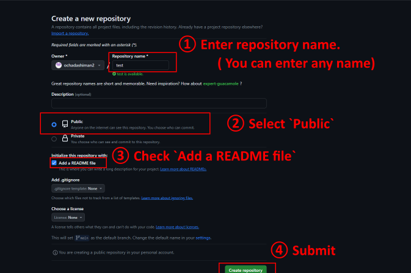

# Guide: How to self-hosting CinemaMod static files
This guide is based on Minecraft version `1.20.1`.

## 1. Getting CinemaMod static files
1. Create a folder on your desktop. (folder name can be anything.)
2. Obtain the static files from either https://cinemamod-static.ewr1.vultrobjects.com/ or https://mcef-download.cinemamod.com/cinemamod-static/.  
You can also get them from my repository (https://github.com/ochadashiman2/CinemaMod-temporary/tree/v1.0.0).
    ```
    [File Structure]
    https://cinemamod-static.ewr1.vultrobjects.com/ or https://mcef-download.cinemamod.com/cinemamod-static/ (or https://github.com/ochadashiman2/CinemaMod-temporary/tree/v1.0.0)
    ├── images
    │   ├── file_thumbnail.jpg
    │   ├── flatscreen_bars.jpg
    │   ├── flatscreen_bg1.jpg
    │   ├── hls_thumbnail.jpg
    │   ├── twitch_thumbnail.jpg
    └── service
        └── v1
            ├── file.html
            ├── hls.html
            ├── twitch.html
            └── youtube.html
    ```
3. Place the files obtained in step 2 into the folder created in step 1.   
Maintain the folder structure as shown in the diagram in step 2.

## 2. Set up a hosting environment
Using software like Apache or Nginx is also possible, but the completely cost-free and simple method is hosting on GitHub Pages.  
This guide will walk you through hosting on GitHub Pages.

1. If you don't have a GitHub account, create one (https://github.com/signup?source=login).
2. Create a new repository (https://github.com/new).  
  
3. Upload `1. Getting the Static Files` section files to your repository.  
  
4. Configure the hosting settings. It may take a few minutes for the settings to take effect.  
  
5. If the hosting settings are successful, your uploaded files will be hosted at `https://{REPLACE TO YOUR GitHub ACCOUNT NAME}.github.io/{REPLACE TO YOUR REPOSITORY NAME}/` (for example, https://ochadashiman2.github.io/CinemaMod-temporary/).  
Access `https://{REPLACE TO YOUR GitHub ACCOUNT NAME}.github.io/{REPLACE TO YOUR REPOSITORY NAME}/service/v1/youtube.html` on browser and confirm that a **black screen** is displayed.  
  

## 3. Build Server-side Jar
**Java 17 must be installed** in the build environment.

1. Download the repository corresponding to the Minecraft version from Github.  
- 1.20.1: https://github.com/CinemaMod/CinemaMod/tree/1.0.6-1.20.1  <br>
  

2. Unzip the downloaded zip file.
3. For all `.java` files included in `CinemaMod-1.0.6-1.20.1/bukkit` folder, replace URL from `https://cinemamod-static.ewr1.vultrobjects.com/` to `https://{REPLACE TO YOUR GitHub ACCOUNT NAME}.github.io/{REPLACE TO YOUR REPOSITORY NAME}/`.  
  
4. Open `CinemaMod-1.0.6-1.20.1/settings.gradle` with text editor and comment out `include('fabric')`.  
  
5. Navigate to `CinemaMod-1.0.6-1.20.1` folder in File Explorer, then open the context menu with `right-click + Shift`. Choose `Open PowerShell window here`. (The screenshot is based on Japanese environment)  
  
6. Execute `.\gradlew build` in the PowerShell window. If the build is successful, `CinemaMod-1.0.6-1.20.1/bukkit/build/libs/CinemaMod-Bukkit-1.0.6-all.jar` created.  
  
  
7. Put jar file into `plugins` directory on your server and restart minecraft server.